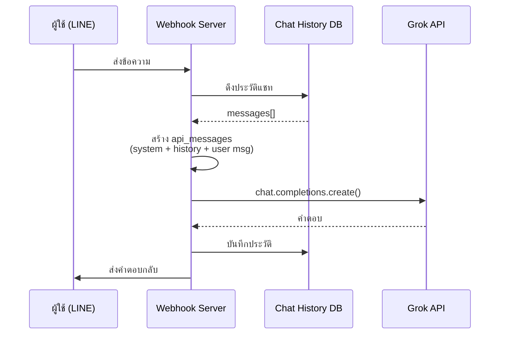
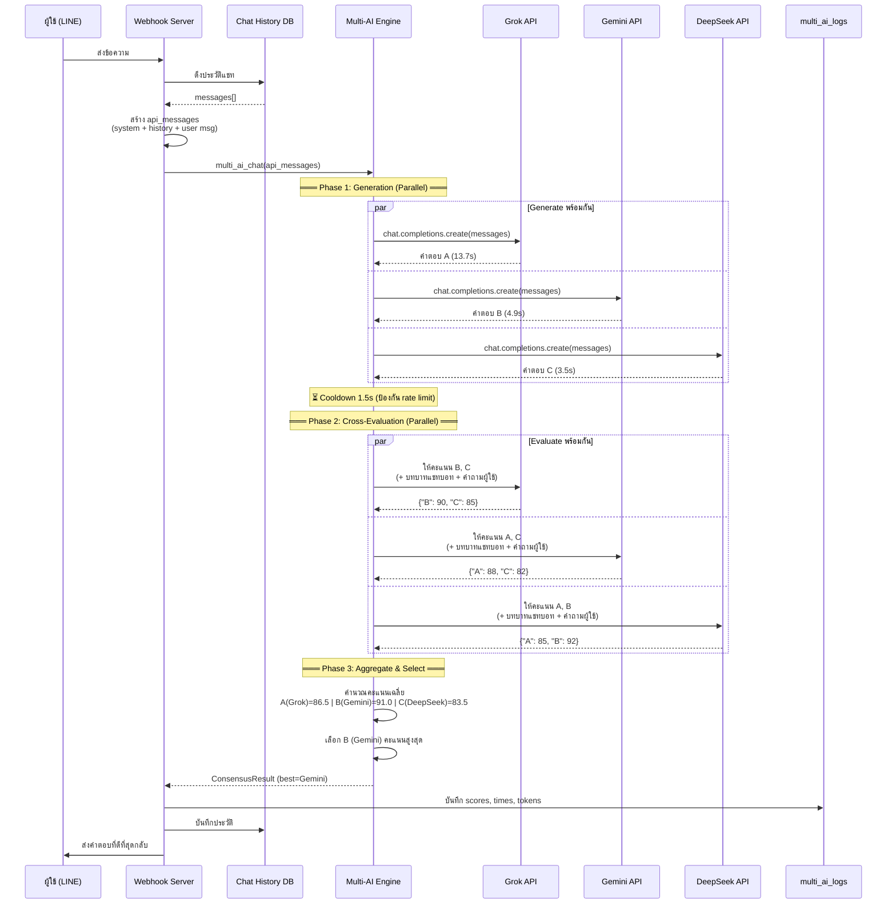
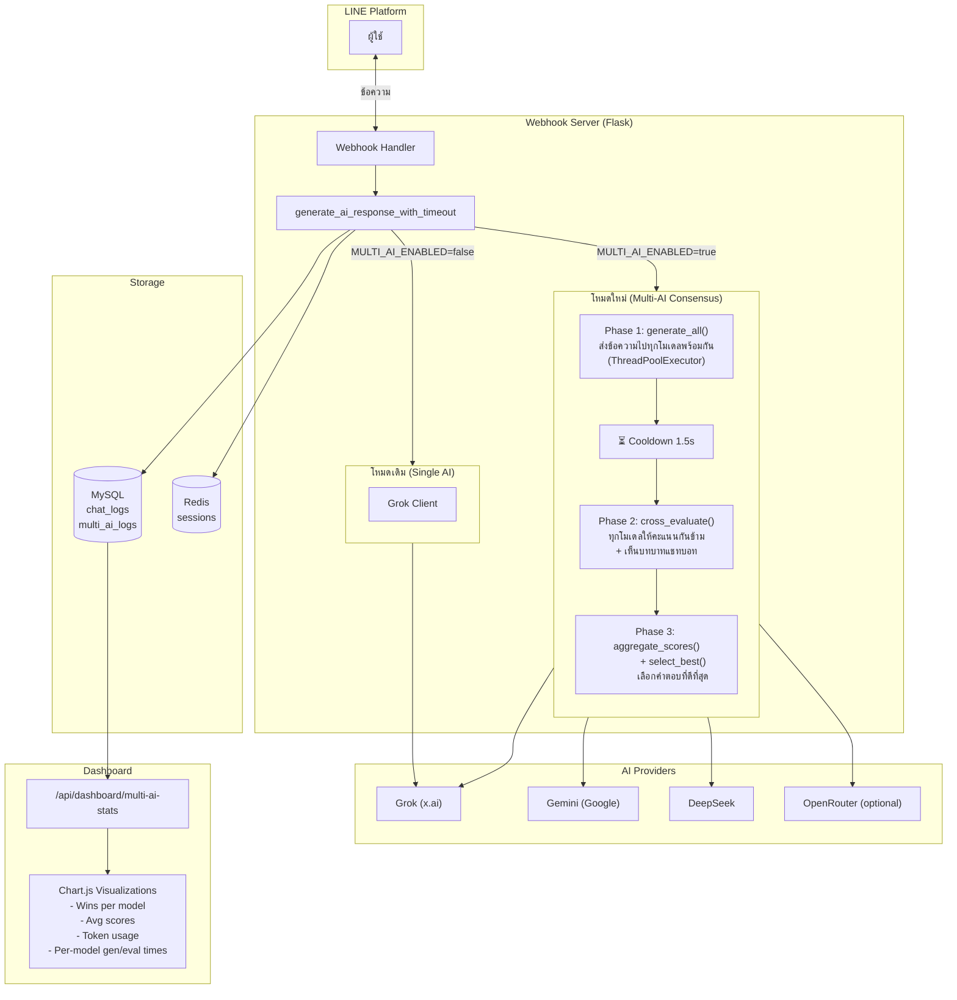
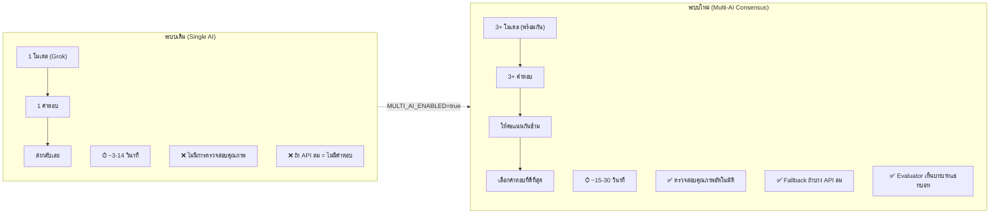
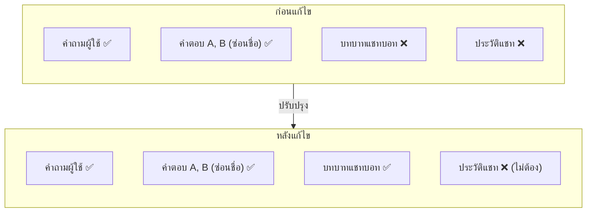
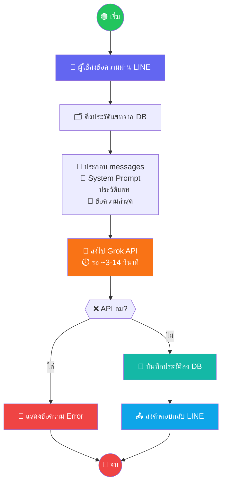

# Multi-AI Consensus System Diagram

## 1. ระบบเดิม (Single AI — Grok Only)

## 2. ระบบใหม่ (Multi-AI Consensus)

## 3. สถาปัตยกรรมภาพรวม (Architecture)

## 4. เปรียบเทียบ (Comparison)

## 5. Evaluation Prompt (สิ่งที่ Evaluator เห็น)

## 6. Flowchart แบบ Icon (เข้าใจง่าย)

### 6.1 ระบบเดิม (Single AI)

### 6.2 ระบบใหม่ (Multi-AI Consensus)

```mermaid
flowchart LR
    START(("🟢\nเริ่ม"))
    MSG["📱\nผู้ใช้ส่งข้อความ\nผ่าน LINE"]
    HIST["🗂️\nดึงประวัติแชท\nจาก DB"]
    BUILD["📝\nประกอบ messages\n🤖 System Prompt\n💬 ประวัติ\n👤 ข้อความ"]
    CHECK{{"⚙️\nMULTI_AI\nENABLED?"}}

    subgraph OLD_PATH["โหมดเดิม"]
        GROK_SINGLE["🧠 Grok API\nเท่านั้น"]
    end

    subgraph PHASE1["⚡ Phase 1 — Generation ขนานกัน"]
        direction TB
        G1["🔴 Grok\n⏱️ 13.7s\n📊 1,943 tok"]
        G2["🔵 Gemini\n⏱️ 4.9s\n📊 1,225 tok"]
        G3["🟢 DeepSeek\n⏱️ 3.5s\n📊 848 tok"]
    end

    COOL["⏳\nCooldown\n1.5s\n🛡️ Rate Limit"]

    subgraph PHASE2["🔍 Phase 2 — Cross-Evaluation ขนานกัน"]
        direction TB
        E1["🔴 Grok ให้คะแนน\n🔵 Gemini & 🟢 DeepSeek"]
        E2["🔵 Gemini ให้คะแนน\n🔴 Grok & 🟢 DeepSeek"]
        E3["🟢 DeepSeek ให้คะแนน\n🔴 Grok & 🔵 Gemini"]
    end

    CONTEXT["📋 Evaluator เห็น:\n🤖 บทบาทแชทบอท\n👤 คำถามผู้ใช้\n📄 คำตอบ A, B ซ่อนชื่อ"]

    subgraph PHASE3["🏆 Phase 3 — เลือกคำตอบ"]
        direction TB
        AGG["📊 คะแนนเฉลี่ย\n🔴 Grok = 86.5\n🔵 Gemini = 91.0 ⭐\n🟢 DeepSeek = 83.5"]
        BEST["🥇 เลือก Gemini\nคะแนนสูงสุด!"]
        AGG --> BEST
    end

    LOG["📈\nบันทึก Dashboard\n⏱️ เวลา\n📊 คะแนน & Tokens"]
    SAVE["💾\nบันทึก DB"]
    REPLY["📤\nส่งคำตอบ\nกลับ LINE"]
    DONE(("🔴\nจบ"))

    START --> MSG --> HIST --> BUILD --> CHECK
    CHECK -->|false| OLD_PATH --> SAVE
    CHECK -->|true| PHASE1
    PHASE1 --> COOL --> PHASE2
    CONTEXT -.-> PHASE2
    PHASE2 --> PHASE3
    PHASE3 --> LOG --> SAVE --> REPLY --> DONE

    style START fill:#22c55e,color:#fff
    style DONE fill:#ef4444,color:#fff
    style MSG fill:#6366f1,color:#fff
    style CHECK fill:#f59e0b,color:#fff
    style COOL fill:#fbbf24,color:#000
    style BEST fill:#22c55e,color:#fff
    style REPLY fill:#0ea5e9,color:#fff
    style LOG fill:#8b5cf6,color:#fff
    style SAVE fill:#14b8a6,color:#fff
    style CONTEXT fill:#e0e7ff,color:#333,stroke:#6366f1,stroke-dasharray:5
    style G1 fill:#ef4444,color:#fff
    style G2 fill:#3b82f6,color:#fff
    style G3 fill:#22c55e,color:#fff
    style E1 fill:#ef4444,color:#fff
    style E2 fill:#3b82f6,color:#fff
    style E3 fill:#22c55e,color:#fff
```

